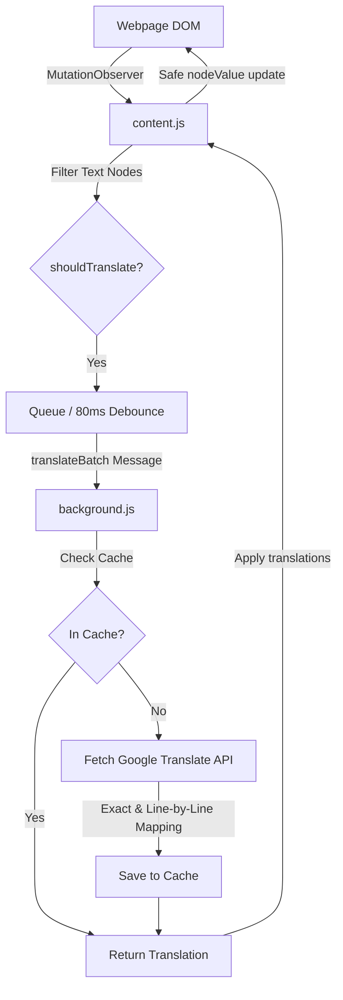

<div align="center">
  
  
  # 🌐 AuraTranslate
  
  ### *Real-Time, Instant, Capture-Free In-Place Web Page Translator*
  
  [](LICENSE)
  [](manifest.json)
  [](manifest.json)
  [](popup.css)
</div>

---

**AuraTranslate** is a lightweight, premium browser extension that translates web pages dynamically in real-time. Built specifically for complex, dynamic modern web applications (like Tencent Hunyuan Video), it intercepts new elements as they enter the screen and instantly replaces Chinese text with clean, contextual English translations without breaking React, Vue, or vanilla page structures.

## 🚀 Key Features

* **⚡ Ultra-Low Latency**: Batches and translates dynamic elements under `80ms` of appearing on screen.
* **🛡️ Structural Integrity Protection**: Safely modifies `nodeValue` rather than outer HTML, preventing framework (React/Vue) application crashes.
* **🔎 Precise DOM Alignment**: Employs an exact-match and line-aligned translation mapping engine to prevent repeating-word issues.
* **🍏 macOS Design System**: A clean, premium, minimalist user interface inspired by Apple macOS settings, featuring slate surfaces, thin iconography, and dark/light system adaptation.
* **📁 In-Memory Caching**: Caches translations in memory and local storage to prevent redundant API calls and rate-limiting.

---

## 🛠️ Architecture

AuraTranslate operates via three distinct layers cooperating asynchronously:



---

## ⚙️ Installation

1. **Clone or Download** this repository:
   ```bash
   git clone https://github.com/HarshaTheCode/aura-translate.git
   ```
2. Open Chrome (or Edge/Brave) and navigate to **Extensions**: `chrome://extensions/`
3. Enable **Developer mode** (toggle in the top-right corner).
4. Click **Load unpacked** in the top-left and select the `translator` directory containing this code.
5. Pin **AuraTranslate** to your toolbar and enjoy a seamless real-time translation experience!

---

## 💻 Tech Stack

* **Core**: Vanilla HTML5, CSS3, ES6+ Javascript.
* **API**: Google Translate Single API.
* **Styles**: Pure Vanilla CSS following Apple Design tokens (custom properties, iOS-style switches, fluid transitions).
* **Storage**: Chrome Extensions `storage.local` API for persistent user preferences and translation caching.

---

<div align="center">
  <sub>Built with ❤️ by <a href="https://github.com/HarshaTheCode">HarshaTheCode</a>. Captcha-free, lightweight, and high-performance.</sub>
</div>
