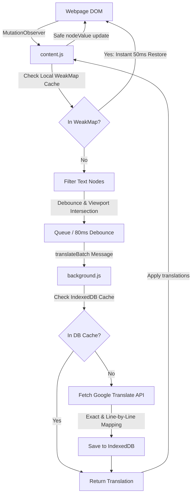

<div align="center">
  

  # 🌐 AuraTranslate
  
  ### *Real-Time, Instant, Capture-Free In-Place Web Page Translator*
  
  <p align="center">
    <a href="LICENSE"></a>
    <a href="manifest.json"></a>
    <a href="manifest.json"></a>
    <a href="popup.css"></a>
  </p>
</div>

---

### 📖 Overview

> **AuraTranslate** is a premium, lightweight browser extension designed to translate modern dynamic web pages (like YouTube, Twitter, and complex SPAs) with zero layout disruption. It intercepts elements as they enter the viewport and translates them seamlessly. By modifying raw `nodeValue` rather than `innerHTML`, it preserves event bindings and prevents React, Vue, or Angular application crashes.

---

## 🚀 Key Features & UI Upgrades

| Feature | Description | Key Performance Metric / UX Spec |
| :--- | :--- | :--- |
| ⚡ **Instant Toggle Caching** | Local memory `WeakMap` cache stores translations in the active tab context. | **~50ms restore** on toggling translation ON/OFF. Zero network or background script latency. |
| 📖 **Bilingual Mode** | Appends translations below text rather than replacing it. | Styled with custom CSS `.aura-bilingual-line` (blue italic subtitle + left accent border). |
| 🌍 **45+ Languages** | Categorized list of world languages. | Organized using `<optgroup>` tags (Popular, European, Asian, Middle Eastern/African). |
| 🛡️ **XSS Hardened Engine** | Safe text updating architecture avoiding `innerHTML`. | Strictly uses `textContent` and raw `nodeValue` modifications. |
| 🔎 **Batched Viewport Scanning** | IntersectionObserver detects elements offscreen for smooth pre-rendering. | Debounces text scan updates into fast **80ms** batch windows. |
| 📁 **IndexedDB Cache** | Database backend to store API key transactions persistently. | Automatic cache expiration keeping storage under 5,000 entries. |
| 🍏 **Apple HSL Design** | Clean, minimalist interface with a macOS slate-surface look. | Native light/dark theme matching, smooth iOS transitions, and active status indicators. |
| 🖱️ **Context Menu & TTS** | Translate highlight tooltips with text-to-speech support. | Starred phrasebook integrations with background save features. |

---

## 🛠️ Architecture

AuraTranslate is built to run asynchronously, ensuring that blocking tasks (such as translation fetch and heavy DOM walking) are completely decoupled from main thread execution.



> [!NOTE]
> By checking the content script's internal `WeakMap` cache before transmitting message payloads, AuraTranslate completely bypasses extension message serialization overhead when toggling state, achieving native browser performance.

---

## ⚙️ Installation & Setup

Setup is straightforward and requires no building steps. Follow this visual step-by-step guide:

### **Step 1: Clone the Repository**
```bash
git clone https://github.com/HarshaTheCode/aura-translate.git
```

### **Step 2: Access Chrome Extensions Menu**
Open Chrome (or Edge/Brave) and navigate to the extensions panel:
> Go to URL: `chrome://extensions/`

### **Step 3: Enable Developer Settings**
Toggle the **Developer mode** switch in the top-right corner of the Extensions dashboard.

### **Step 4: Load Unpacked Source**
1. Click the **Load unpacked** button in the top-left corner.
2. Select the `translator` directory containing this code.

### **Step 5: Pin the Extension**
Click the puzzle piece icon on your browser toolbar and pin **AuraTranslate** for easy setup.

---

## 💻 Technical Stack

The extension is crafted with vanilla technologies to remain lightweight and Vercel/hosting compatible:

| Layer | Technology | Usage & Specification |
| :--- | :--- | :--- |
| **Logic & Observers** | Core ES6+ JavaScript | Zero external runtime dependencies. Runs purely on native APIs. |
| **Styling & Layout** | CSS3 & HTML5 | Follows Apple Design Tokens with clean CSS custom properties and HSL variables. |
| **Persistent Cache** | IndexedDB API | Decoupled client database running inside the background service worker. |
| **Extension Storage** | Chrome Storage API | Handles persistent configuration options via `chrome.storage.local`. |
| **Translation Engine** | Google Translate Single API | Intercepts, aligns, and batches translations with line-by-line mapping. |

---

## 🔮 Future Roadmap

These planned updates represent the upcoming development phases for the codebase:

```markdown
- [ ] ⌨️ Custom Keyboard Shortcuts: Custom key bindings (e.g. `Alt+T` for toggle, `Alt+S` for TTS pronunciation).
- [ ] 🏷️ Dynamic Badge Status: Toolbar icon counts showing live translation statistics for the current page.
- [ ] 🔑 "Bring Your Own Key" (BYOK) Mode: Secure API key configuration panel for power users to input custom DeepL/OpenAI credentials.
- [ ] 🤖 LLM Translation Engines: Multi-engine support to translate using context-aware AI models (OpenAI, Gemini, Claude).
- [ ] 🗃️ Cloud Starred Phrasebook: Syncing saved translations across multiple browser instances.
```

---

<div align="center">
  <sub>Built with ❤️ by <a href="https://github.com/HarshaTheCode">HarshaTheCode</a>. Captcha-free, lightweight, and high-performance.</sub>
</div>
