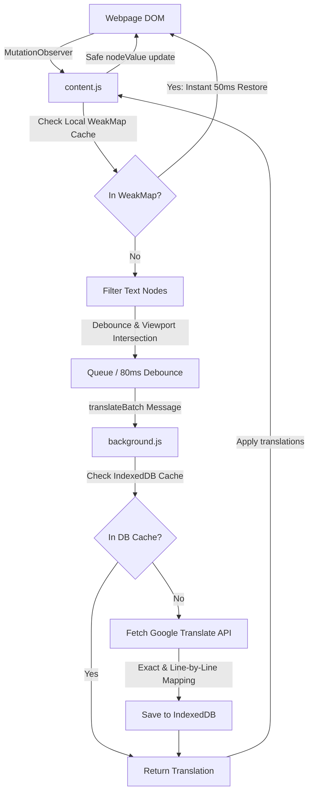

<div align="center">
  
  
  # 🌐 AuraTranslate
  
  ### *Real-Time, Instant, Capture-Free In-Place Web Page Translator*
  
  [](LICENSE)
  [](manifest.json)
  [](manifest.json)
  [](popup.css)
</div>

---

**AuraTranslate** is a premium, lightweight browser extension that translates web pages dynamically in real-time. Designed to handle complex, dynamic modern web applications (like YouTube, Twitter, and modern SPAs) with zero layout disruption, it intercepts elements as they enter the screen and translates them seamlessly. 

It safely modifies `nodeValue` rather than outer HTML, preventing framework (React, Vue, Angular) application crashes and preserving dynamic JS binding.

---

## 🚀 Key Features & Updates (v1.2.0)

* **⚡ DOM-Level Translation Caching (Instant Toggle)**: Implements local memory `WeakMap` caching in the content script. Toggling translation OFF and back ON executes in **~50ms** without triggering API calls, background messages, or DOM reflows.
* **📖 Bilingual Side-by-Side Mode**: View original text and translated text simultaneously. Appends a styled, non-intrusive blue italic translation annotation below target text elements, complete with custom CSS highlights.
* **🌍 45+ Languages Support**: Expanded from 6 to over 45+ languages. Organized cleanly into groups (Popular, European, Asian, Middle Eastern & African) using `<optgroup>` dropdown wrappers.
* **🛡️ Security & XSS Hardening**: Audited and secured against cross-site scripting (XSS) and Content Security Policy (CSP) violations by enforcing strict `textContent` and raw text node updates rather than `innerHTML`.
* **🔎 IntersectionObserver-Driven Batched Translation**: Pre-translates elements slightly offscreen for a smooth scrolling experience, and debounces calls into 80ms batches to minimize API overhead.
* **📁 Persistent Cache (IndexedDB)**: Features a robust IndexedDB backend in `background.js` to preserve API keys, manage caching limits (up to 5,000 entries), and prevent redundant service calls.
* **🍏 Apple iOS/macOS Design System**: Premium, ultra-clean UI/UX featuring system-adaptive light/dark modes, iOS-style fluid toggles, active status indicators (live red/green dot), skeleton loading states, and live translated count badges.
* **🖱️ Starred Phrasebook & Context Menus**: Select any text on a page to translate, hear its pronunciation, or save it to a starred phrasebook. Also supports right-click page translations.

---

## 🛠️ Architecture

AuraTranslate operates via a layered, asynchronous system prioritizing caching and performance:



---

## ⚙️ Installation

1. **Clone or Download** this repository:
   ```bash
   git clone https://github.com/HarshaTheCode/aura-translate.git
   ```
2. Open Chrome (or Edge/Brave) and navigate to **Extensions**: `chrome://extensions/`
3. Enable **Developer mode** (toggle in the top-right corner).
4. Click **Load unpacked** in the top-left and select the `translator` directory containing this code.
5. Pin **AuraTranslate** to your toolbar and enjoy a seamless real-time translation experience!

---

## 💻 Tech Stack

* **Core**: Vanilla HTML5, CSS3, ES6+ Javascript (Zero external library dependencies).
* **API**: Google Translate Single API.
* **Database**: IndexedDB API for persistent storage caching.
* **Styles**: Pure Vanilla CSS following Apple Design tokens (custom HSL variables, iOS-style switches, fluid transitions).
* **Storage**: Chrome Extensions `storage.local` API for persistent user preferences.

---

## 🔮 Future Roadmap (Planned Features)

Based on developer and user alignment, here is what we are planning to implement next as the extension scales up:

1. **⌨️ Custom Keyboard Shortcuts**:
   - Assignable hotkeys (e.g., `Alt+T` to toggle translation, `Alt+S` to speak selection) to make navigation seamless for power users.
2. **🏷️ Extension Icon Status Badges**:
   - Dynamically update the extension’s toolbar icon with badge text or indicator colors to show translation counts or active translation states.
3. **🔑 "Bring Your Own Key" (BYOK) Option**:
   - Once user limits scale past 100+ active installs, introduce an option in the UI allowing users to input their own API credentials (Google Cloud, DeepL, or OpenAI) to support larger translation volumes.
4. **🤖 LLM-Based Translation Engines**:
   - Integrate with advanced AI translation APIs (Google Gemini, OpenAI GPT, or Claude) for highly contextual, colloquial, and natural translations.
5. **🗃️ Synced Phrasebook & Practice Interface**:
   - An options page interface to view, search, tag, practice, and export starred/saved phrases.

---

<div align="center">
  <sub>Built with ❤️ by <a href="https://github.com/HarshaTheCode">HarshaTheCode</a>. Captcha-free, lightweight, and high-performance.</sub>
</div>
